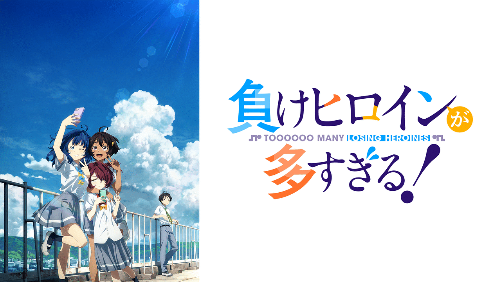

自分が見た2024年夏アニメの感想を書いていく。  
今期はなぜかラブコメ学園ものが多い。

[:contents]

### 時々ボソッとロシア語でデレる隣のアーリャさん

[https://youtu.be/Fj2GF_Q_Fho?si=zw2f3bTW_kCgXaX2:embed]

通称**ロシデレ**。原作は角川スニーカー文庫のライトノベル。

ジャンルとしては、中学校で生徒会役員を務めていたアニメオタクの主人公が、高校の生徒会で俺TUEEEEする**学園ラブコメ×頭脳戦**もの。

**ロシアハーフ×ツンデレ**の**アーリャ**や**アニメオタク×ブラコン妹**の**周防有希**といった、個性あるヒロインたちが多く登場する。  
主人公やヒロインたちの過去に関する思わせぶりな回想シーンが多くあったが、アニメ最終話まで掘り下げはなかった。

「ロシア語でデレる」というタイトルから推察できるように、メインヒロインの**アーリャ**の声優は上坂すみれ。

以前原作が話題になっていた際、  
「**タイトルからして、アニメ化したらヒロインの声優はどうせ上坂すみれだろう**」  
と思っていたが、案の定。

ただこのアニメはその上坂すみれを最大限活用しており、なんとEDが全12話別々に用意され、OPを含むすべての曲を上坂すみれが歌っている。

最終話のオリジナルED**ハナモヨイ**以外は昭和から令和までの流行ソングを上坂すみれがカバーしており、OP**一番輝く星**と合わせて計13曲をすべて上坂すみれが歌っている。

ここまで上坂すみれを酷使しているアニメは今までなく、まさに上坂すみれの代表作の1つと言える。

    

        <b>
        ED一覧（※ネタバレ注意）
        </b>
        <u>
        [ 展開 ]
        </u>
    

    <table>
            <thead>
                <tr>
                    <th>話</th>
                    <th>曲</th>
                    <th>アーティスト</th>
                </tr>
            </thead>
            <tbody>
                <tr>
                    <td>1話</td>
                    <td>学園天国</td>
                    <td>フィンガー5</td>
                </tr>
                <tr>
                    <td>2話</td>
                    <td>可愛くてごめん</td>
                    <td>HoneyWorks</td>
                </tr>
                <tr>
                    <td>3話</td>
                    <td>想い出がいっぱい</td>
                    <td>H2O</td>
                </tr>
                <tr>
                    <td>4話</td>
                    <td>ハレ晴レユカイ</td>
                    <td>涼宮ハルヒの憂鬱ED</td>
                </tr>
                <tr>
                    <td>5話</td>
                    <td>小さな恋の歌</td>
                    <td>MONGOL800</td>
                </tr>
                <tr>
                    <td>6話</td>
                    <td>秘密の言葉</td>
                    <td>花譜 × ズーカラデル</td>
                </tr>
                <tr>
                    <td>7話</td>
                    <td>ラブストーリーは突然に</td>
                    <td>小田和正</td>
                </tr>
                <tr>
                    <td>8話</td>
                    <td>CHE.R.RY</td>
                    <td>YUI</td>
                </tr>
                <tr>
                    <td>9話</td>
                    <td>ワールドイズマイン</td>
                    <td>ryo（supercell）</td>
                </tr>
                <tr>
                    <td>10話</td>
                    <td>こいのうた</td>
                    <td>GO!GO!7188</td>
                </tr>
                <tr>
                    <td>11話</td>
                    <td>気まぐれロマンティック</td>
                    <td>いきものがかり</td>
                </tr>
                <tr>
                    <td>12話</td>
                    <td>ハナモヨイ</td>
                    <td>上坂すみれ ※オリジナル曲</td>
                </tr>
            </tbody>
    </table>

※すべて[<u>公式Youtubeチャンネル</u>](https://www.youtube.com/channel/UCvNxYM7Cwrz8p7_WjzjxWcA)にて無料配信中

[https://youtu.be/YbKqZF3wc5g?si=DOoxVa0mh796s78G:embed]

毎回EDが変わるので、今回はどの曲がカバーされるのかを期待させるつくりになっている。

筆者は毎週リアルタイムで見ていたので  
「**この令和の時代に ED がハレ晴レユカイ！？**」  
と懐かしい気持ちになれたのは良い体験であった。

ちなみに、1話・2話は視聴者を繋ぎ止めるためか**着替え**・**パンチラ**等のテコ入れが多いが、それ以降は8話の**謎催眠回**を除いてまったくないので注意。

追記）2期の制作決定が発表された。主人公やヒロインたちの過去の更なる掘り下げが期待される。

### 2.5次元の誘惑

[https://youtu.be/pN8EE8d9yYE:embed]

（編集時点で2クールの内1クールしか放送されていないため、1クール目の感想）

ED**Watch Me**がテンポ良く、個人的にかなり好み。

放送開始当時はED曲の発売時期が8月末予定であったが、想定以上の人気が出たためか、8月頭に急遽配信された。

最終話ではじめてOPがFullで流れるのも味があって良いが、最近のアニメ主題歌は2・3話が放送されたあたりで発売・配信されることが多く、アニソンはブームにも繋がるためそちらの方が最善だと思う。

### 負けヒロインが多すぎる！

[https://youtu.be/uytJ6_KTCZI?si=xjICjbDc0zgSTzNT:embed]

個人的に今期の覇権アニメ。

タイトルの通り、いわゆる**負けヒロイン**である3人のヒロイン達の葛藤・人間関係・成長を描いた物語。

ギャグと青春ラブコメがバランス良く織り交ぜられており、展開が見ていて飽きさせないものになっている。

**負けヒロイン**という言葉から、  
「**ただサブヒロインがメインヒロインに恋愛で負けて終わり**」  
という印象を受けるが、このアニメはヒロインたちが負けた後の拗れた人間関係に向き合い、成長する場面が鮮明に描かれている。

また、1話から「これ映画か？」と思わせるような演出が多く、最後までそのクオリティを維持している。

登場するヒロインは3人、それぞれのエピソードが約4話ずつ取り上げられていく。  
4話が1つ目の区切りなので、とりあえず何も言わずに4話までは見てほしい。

### しかのこのこのここしたんたん

[https://youtu.be/ITFklIWu0Wg?si=LnQ_DAoxHWSiW1WE:embed]

これの感想いる？
たまにあるパロディギャグアニメ。OP**シカ色デイズ**が話題になりSNSでバズったが、内容が意味不明すぎておそらくほとんどの人は最後まで見ていない。

この手のパロディネタアニメは普段アニメを見ない人には元ネタがまったくわからないため、大衆受けが悪いのは仕方がない気もする。

あと、放送当時ニコニコ動画がサイバー攻撃を受けてダウンしていたのもあり、この手のアニメにありがちな「ニコニコで見るとおもしろい」が通用しなくなってしまったのも不運。

なんだかんだ最後まで見たが、最終回は鹿モチーフの某有名ゆるキャラが登場するなど、アツい展開があり、作品が持てるポテンシャルは十分に発揮されていたような気がする。（小並感）

<b>おわり</b>

<!-- 記事タイトル：アニメ感想（2024夏） -->

<!-- css -->

